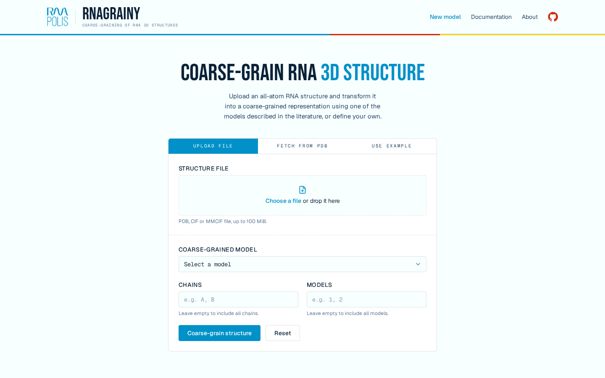
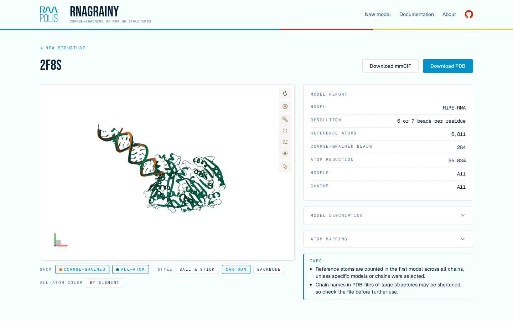
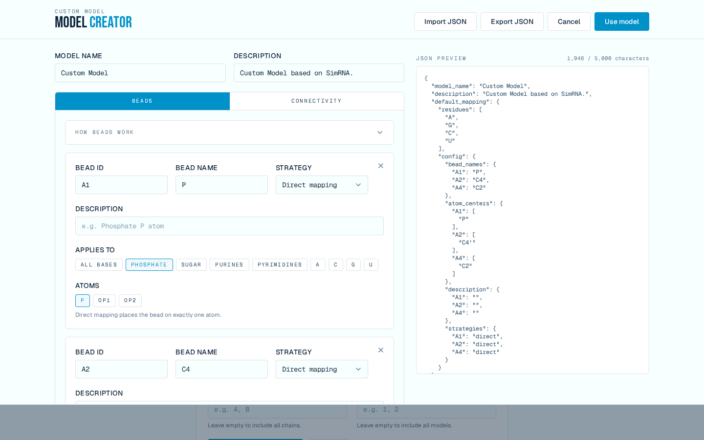
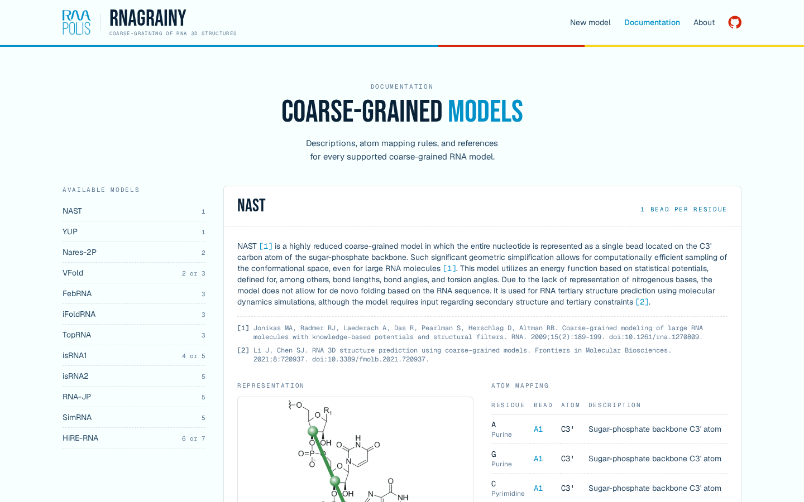

# RNAgrainy

> A universal platform for generating, visualizing, and comparing coarse-grained RNA structure models.

[**Open RNAgrainy**](https://rnagrainy.cs.put.poznan.pl/) ·
[**Documentation**](https://rnagrainy.cs.put.poznan.pl/documentation/)


## About

RNAgrainy is a web-based bioinformatics platform for generating, visualizing, and comparing coarse-grained representations of RNA structures.

The application enables the transformation of all-atom RNA structures into simplified coarse-grained representations using multiple models described in the scientific literature. It also provides tools for defining custom coarse-grained representations.

## Scientific Background

RNA molecules play essential roles in many biological processes, and understanding their structure and dynamics is important for studying their function.

All-atom molecular representations provide detailed structural information but may become computationally expensive when used in simulations of large RNA molecules or over long timescales. Coarse-grained models reduce the number of interaction sites by representing groups of atoms as simplified particles or pseudoatoms.

Different coarse-grained RNA models use different mapping strategies, resolutions, and representations. RNAgrainy provides a unified environment for generating and comparing these representations from the same input RNA structure.

## Key Features

* **Structure import:** Support for PDB and PDBx/mmCIF files, as well as direct retrieval of structures from the RCSB PDB database using a PDB ID. Predefined example structures can also be selected.
* **Coarse-grained model selection:** Selection of predefined RNA coarse-grained models described in the scientific literature.
* **Chain and structure model selection:** Users can select specific chains and structural models from the input structure.
* **Interactive visualization:** Comparison of the original all-atom structure and the generated coarse-grained representation using the Mol* molecular visualization library.
* **Custom model creator:** Define custom coarse-grained representations, pseudoatom mappings, and connectivity rules through an interactive editor, or load an existing model configuration from JSON.
* **Structure export:** Generated coarse-grained structures can be exported in standard PDB and PDBx/mmCIF formats.
* **Model documentation:** The application provides descriptions of supported coarse-grained models, atom mapping rules, and references to the original scientific literature.

## Supported Models

RNAgrainy currently supports the following predefined coarse-grained RNA models:

`NAST` · `YUP` · `Nares-2P` · `VFold` · `FebRNA` · `iFoldRNA` ·
`TopRNA` · `isRNA1` · `isRNA2` · `RNA-JP` · `SimRNA` · `HiRE-RNA`

Detailed descriptions, mapping rules, and references are available in the
[model documentation](https://rnagrainy.cs.put.poznan.pl/documentation/).

## Application Preview

### Main page



### Coarse-grained structure comparison



### Custom coarse-grained model creator



### Model documentation



## Local Development

The backend is a FastAPI application (`app/`) exposing a JSON API under `/api`. The
frontend is a React + TypeScript application built with Vite (`frontend/`). In
production, FastAPI serves the built frontend; during development, the Vite dev server
serves it with hot reloading and proxies `/api` and `/static` to the backend.

### Tech stack

- **Backend:** Python 3.12, FastAPI, Pydantic, Gemmi
- **Frontend:** React 19, TypeScript, Vite, Tailwind CSS 4, TanStack Query, React Router,
  Mol*
- **Tooling:** Ruff, mypy, pytest, Playwright, ESLint, Prettier, Vitest, pre-commit
- **Deployment:** Docker (multi-stage build of the frontend and backend), GitHub Actions

### Project structure

```text
app/                  FastAPI backend
  coarse_grain/       coarse-graining algorithm and model definitions
  routes/             JSON API endpoints and the frontend catch-all route
  services/           structure loading, coarse-graining, and result workspaces
  static/             example structures and model images
frontend/             React + TypeScript frontend (Vite)
  src/api/            typed API client and TanStack Query hooks
  src/features/       upload form, model creator, results viewer, model docs
  src/pages/          routed pages (home, results, documentation, about)
  src/components/     layout, brand, and shared UI components
tests/                backend unit, integration, and Playwright E2E tests
docs/screenshots/     screenshots used in this README
```

### API

| Method | Endpoint                                  | Description                                    |
| ------ | ----------------------------------------- | ---------------------------------------------- |
| `GET`  | `/api/config`                             | Supported formats, upload limits, example IDs  |
| `GET`  | `/api/models`                             | Available coarse-grained models                |
| `POST` | `/api/coarse-grain/file`                  | Coarse-grain an uploaded structure file        |
| `POST` | `/api/coarse-grain/rcsb`                  | Coarse-grain a structure fetched by PDB ID     |
| `POST` | `/api/coarse-grain/preset`                | Coarse-grain one of the example structures     |
| `GET`  | `/api/results/{workspace_id}/{file_type}` | Download the reference or coarse-grained file  |
| `POST` | `/api/results/{workspace_id}/consumed`    | Remove a result workspace after it was loaded  |

The interactive API documentation is available at `/docs` when the backend is running.

### Requirements

Install the following tools:

- Python 3.12
- Pipenv
- Node.js 24 with npm
- Docker with Docker Compose (optional, to run the production image)

### Install dependencies

Install Pipenv:

```bash
python -m pip install pipenv==2026.6.2
```

Install Python dependencies, including development tools:

```bash
pipenv sync --dev
```

Install frontend dependencies:

```bash
cd frontend
npm ci
```

Install the Git hooks configured by the project:

```bash
pipenv run pre-commit install
```

### Start the development environment

Start the backend in the first terminal:

```bash
pipenv run uvicorn app.main:app --port 5050 --reload
```

Start the frontend dev server in a second terminal:

```bash
cd frontend
npm run dev
```

The application is available at `http://127.0.0.1:5173`. The Vite dev server proxies
the API to `http://127.0.0.1:5050`; override it with the `BACKEND_URL` environment
variable.

### Run the production build

Build the frontend and let FastAPI serve it:

```bash
cd frontend && npm run build && cd ..
pipenv run uvicorn app.main:app --port 5050
```

Or build and run the Docker image, which builds the frontend itself:

```bash
docker compose -f compose.yaml -f compose.dev.yaml up --build app
```

Either way, the application is available at `http://127.0.0.1:5050`.

### Checks

Backend: `pipenv run ruff check .`, `pipenv run mypy`, and the test suites, run
separately as in CI (Playwright's event loop clashes with the async unit tests when they
share a session; the E2E tests also need a frontend build):

```bash
pipenv run pytest tests/unit
pipenv run pytest tests/integration
pipenv run pytest tests/e2e
```

Frontend, in `frontend/`: `npm run lint`, `npm run format:check`, `npm run typecheck`,
`npm test`.

The pre-commit hooks run the formatters, linters, type checks, and the backend unit and
integration tests together with the frontend checks. GitHub Actions runs all checks,
including the E2E tests and a Docker Compose health check, on every pull request and on
pushes to `main` and `develop`.

## Authors

### Development

[Sergiusz Urbaniak](https://github.com/serguppp)¹, [Michał Konon](https://github.com/mihakon)¹

### Scientific supervision

[Marta Szachniuk](https://www.cs.put.poznan.pl/mszachniuk/site/)¹˒²

¹ Institute of Computing Science, Poznan University of Technology, Poland  
² Institute of Bioorganic Chemistry, Polish Academy of Sciences, Poznan, Poland
